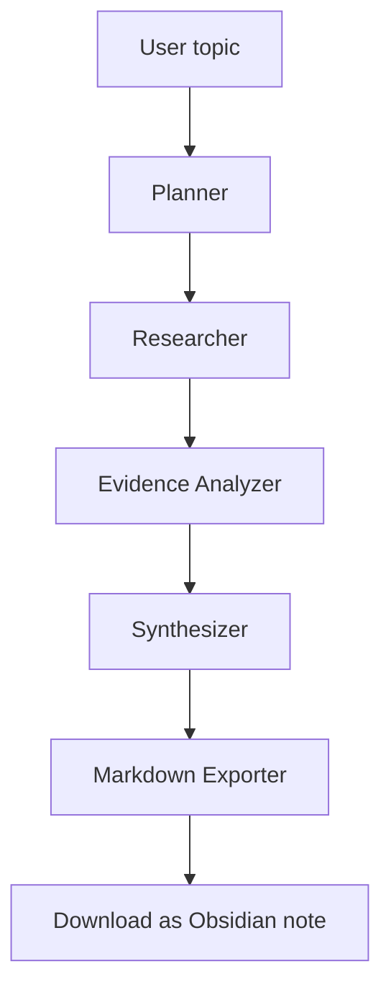

# ResearchSynth

A small AI research assistant built for a one-week internship sprint. It takes a research topic, generates a few focused questions, searches the web with Tavily, analyzes the evidence, and exports a clean Markdown report for Obsidian.

## Features

- Generates 3–5 useful research questions
- Searches the web using Tavily for each question
- Extracts evidence-backed claims from search results
- Synthesizes a concise research report in Markdown
- Exports a file with Obsidian frontmatter for direct use in notes
- Simple Streamlit interface for running the workflow and downloading the report

## Architecture



The project uses a compact LangGraph workflow with a shared state object that stores the topic, questions, search results, evidence, report, and Markdown export.

## Tech Stack

- Python 3.12+
- LangGraph
- LangChain
- langchain-tavily
- Groq/OpenAI-compatible models
- Tavily Search
- Streamlit
- Pydantic
- Python-dotenv

## Setup

1. Create a virtual environment:
   ```bash
   python -m venv .venv
   source .venv/bin/activate  # Linux/macOS
   .venv\Scripts\activate     # Windows
   ```
2. Install dependencies:
   ```bash
   pip install -r requirements.txt
   ```
3. Create a `.env` file based on `.env.example` and add your keys:
   ```bash
   GROQ_API_KEY=your_key_here
   TAVILY_API_KEY=your_key_here
   GROQ_MODEL=openai/gpt-oss-20b
   ```

## Run locally

```bash
streamlit run main.py
```

Then open the local URL shown in the terminal and enter a research topic.

## Example usage

- "Impact of AI agents on software development"
- "How renewable energy affects grid resilience"
- "What are the current challenges in AI safety research?"

## How the LangGraph workflow works

1. Planner: generates research questions from the topic.
2. Researcher: searches for each question with Tavily.
3. Evidence Analyzer: filters search results and extracts only evidence-backed claims with matching sources.
4. Synthesizer: writes a final Markdown report from the evidence.
5. Markdown Exporter: adds Obsidian frontmatter and prepares the downloadable file.

## Limitations

- Results depend heavily on the quality and availability of external search results.
- The workflow is intentionally small and not designed for large-scale research pipelines.
- Tavily and LLM providers may return empty or low-quality responses when the topic is unclear or under-sourced.
- This MVP is targeted for a simple research assistant, not a full autonomous research system.
